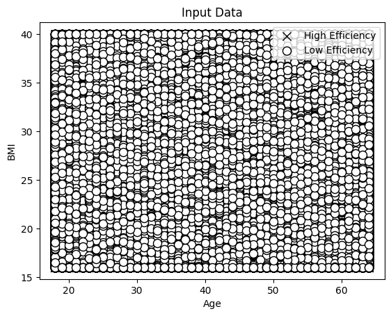
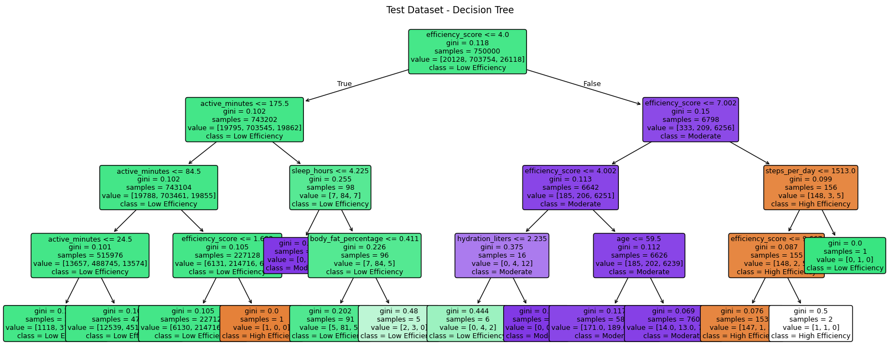
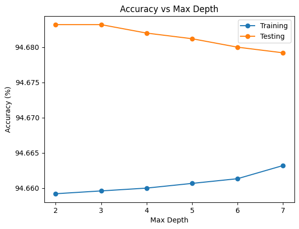

# Decision Tree Classifier — Calorie Efficiency Prediction

A machine learning project that uses a **Decision Tree Classifier** to predict calorie efficiency based on health and physical attributes such as Age and BMI.

---

## Project Overview

This project trains a Decision Tree model on a calorie efficiency dataset. It classifies individuals into calorie efficiency categories using features like Age, BMI, and other health metrics. The notebook covers the full ML pipeline — from data loading to model evaluation.

---

## Dataset

- **File:** `calorie_efficiency_dataset.csv`
- **Target Column:** `calorie_efficiency` (categorical — label encoded)
- **Features Used:** Age, BMI, and other health-related columns
- **Split:** 75% Training / 25% Testing

---

## Project Structure

```
code.ipynb                        ← Main Jupyter Notebook
calorie_efficiency_dataset.csv    ← Input Dataset
README.md                         ← Project Documentation
```

---

## How It Works

### 1. Load Dataset
Reads the CSV file using pandas and displays the shape and first 5 rows.

### 2. Label Encoding
The target column `calorie_efficiency` contains text labels. These are converted to numeric values using `LabelEncoder`.

```
Example:
  'efficient'     --> 0
  'not_efficient' --> 1
```

### 3. Visualize Input Data
A scatter plot is generated showing **Age vs BMI** for each class.

> **Figure 1 — Input Data (Age vs BMI)**
> Shows distribution of two classes using `x` markers (class 0) and `o` markers (class 1).



---

### 4. Train/Test Split

```python
X_train, X_test, y_train, y_test = train_test_split(X, y, test_size=0.25, random_state=5)
```

### 5. Train Decision Tree

```python
classifier = DecisionTreeClassifier(random_state=0, max_depth=4)
classifier.fit(X_train, y_train)
```

- `max_depth=4` limits tree depth to avoid overfitting

### 6. Visualize Decision Tree

> **Figure 2 — Decision Tree (Training Dataset)**
> Full tree visualization with feature names, class names, and color-filled nodes.




---

### 7. Evaluate Performance

Classification report is printed for both training and test datasets showing:
- Precision
- Recall
- F1-Score
- Support

### 8. Compute Accuracy

```python
Training Accuracy: XX.XX %
Test Accuracy:     XX.XX %
```

---

### 9. Accuracy vs Max Depth

Different values of `max_depth` (2 to 7) are tested to compare training and test accuracy.

> **Figure 3 — Accuracy vs Max Depth**
> Line plot comparing training accuracy and test accuracy at different tree depths.
> Helps identify the optimal depth before overfitting occurs.



---

## Libraries Used

| Library | Purpose |
|---|---|
| `numpy` | Numerical operations |
| `pandas` | Data loading and manipulation |
| `matplotlib` | Plotting and visualization |
| `sklearn` | Machine learning model and evaluation |

---

## How to Run

1. Install required libraries:
```bash
pip install numpy pandas matplotlib scikit-learn
```

2. Place `calorie_efficiency_dataset.csv` in the same directory as the notebook.

3. Open and run `code.ipynb` in Jupyter Notebook or JupyterLab.

---

## Key Parameters

| Parameter | Value |
|---|---|
| `max_depth` | 4 (default run) |
| `test_size` | 0.25 |
| `random_state` | 0 (model), 5 (split) |

---

## Results Summary

- The model produces **3 visualizations**: Input data scatter plot, Decision Tree diagram, and Accuracy vs Depth curve.
- Classification report is printed for both **training and test sets**.
- Accuracy vs Depth plot helps in selecting the **best max_depth** value.

## Developer 

Imran Ghafoor

